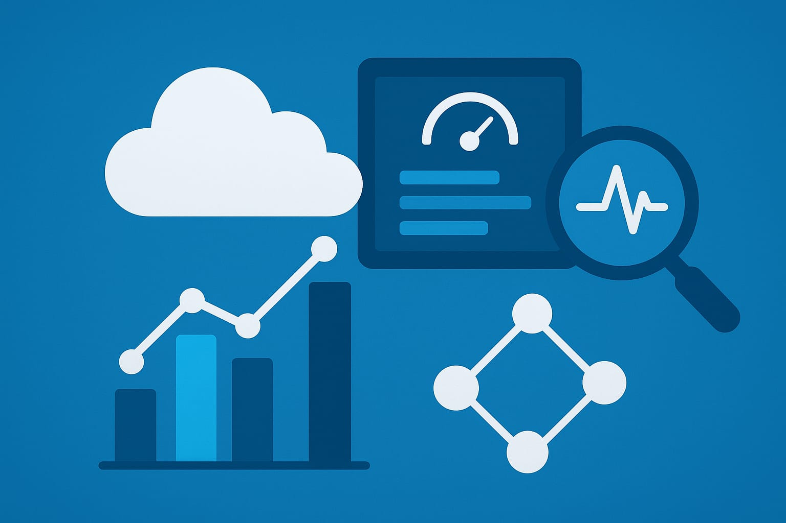

# 👨‍💻 Pierre Santos  
### *Observabilidade e Cloud para um futuro resiliente ☁️*

**Site Reliability Engineer | Cloud Infrastructure | AWS | Terraform | Monitoring & Observability | Big Data & Data Engineering**

---

## 🌐 Site Profissional

📎 Acesse meu perfil completo:  
👉 [https://www.linkedin.com/in/pierremsantos/](https://www.linkedin.com/in/pierremsantos/)  
🏅 Veja minhas certificações e badges:  
👉 [https://www.credly.com/users/pierre-santos/badges#credly](https://www.credly.com/users/pierre-santos/badges#credly)

---

## 🧭 Resumo Profissional

Profissional com mais de 10 anos de experiência em **Infraestrutura, Cloud e Observabilidade**, atuando como **Site Reliability Engineer (SRE) e Cloud Engineer.**
Especialista em **AWS, Kubernetes, CI/CD, observabilidade (Grafana, Datadog, Prometheus, Alertmanager)** e automação com **Terraform e Ansible.**

Com sólida experiência em **produtização de SLI/SLO**, gestão de incidentes, cultura DevOps e otimização de desempenho de aplicações e sistemas distribuídos.

Apaixonado por **confiabilidade, métricas e inovação,** sempre buscando simplificar e automatizar ambientes complexos em cloud.

---

## 💼 Experiência Profissional
# 🏦 Itaú Unibanco

# SRE | Cloud Engineer | Observability

# 📅 abr/2021 – set/2025

 - Implementação de pipelines CI/CD com Jenkins, GitLab e ArgoCD.
 - Criação e manutenção de dashboards de observabilidade (Grafana, Datadog, Prometheus).
 - Desenvolvimento de automações com Terraform, Python e Shell Script.
 - Produtização de SLI/SLOs e integração com Alertmanager e ServiceNow.
 - Projetos de modernização em CDP (Cloudera Data Platform), integrando observabilidade com AWS e CloudWatch.

# Principais resultados:
- ✅ Redução de 60% no MTTR com automação de alertas e incidentes.
- ✅ Aumento da confiabilidade dos clusters Hadoop e CDP.

---

## ☁️ Cargo Anterior – Infraestrutura Cloud / SysOps / DevOps

# 📅 2017 – 2021

- Migração de ambientes VMware → OpenStack → AWS.
- Administração de servidores Linux, tuning de performance e segurança.
- Monitoramento com Zabbix, CloudWatch e Datadog.
- Criação de scripts para provisionamento e automação de tarefas.
- Stack utilizada: AWS, Ansible, Terraform, Docker, Git, Shell Script, Python.

---

## 💻 Experiências anteriores (2012–2017)

- Analista de Sistemas / SysAdmin / Suporte Cloud
- Administração de sistemas Linux e Windows.
- Monitoramento de infraestrutura e gestão de incidentes.
- Atuação em ambientes críticos de alta disponibilidade.

## 🧩 Principais Competências Técnicas

- ☁️ Cloud: AWS, Azure, OpenStack, Cloudera CDP
- 🧠 SRE / Observabilidade: Datadog, Grafana, Prometheus, Alertmanager, CloudWatch
- 🛠️ Infraestrutura como Código: Terraform, Ansible, CloudFormation
- 🐳 Containers: Docker, Kubernetes, Helm
- ⚙️ CI/CD: Jenkins, GitLab CI, ArgoCD
- 📊 Logs e Métricas: Loki, ELK Stack, CloudWatch Logs
- 💾 Banco de Dados: PostgreSQL, MySQL, DynamoDB
- 💻 Linguagens: Python, Bash, YAML, SQL

---

## 🎓 Formação Acadêmica

### MBA em Gestão Empresarial  
📍 **Fundação Getulio Vargas (FGV)** | 2019 – 2021

**Soft Skills:**  
Liderança e influência positiva · Pensamento estratégico · Visão sistêmica de negócios · Capacidade analítica · Comunicação assertiva · Gestão de mudanças · Tomada de decisão orientada a resultados · Networking e relacionamento profissional  

**Competências Técnicas:**  
Negociação e decisão baseada em dados · Planejamento estratégico · Gestão de equipes · Governança corporativa · Gestão de projetos (PMBOK, Ágil) · Finanças e viabilidade · Inovação e transformação digital · KPIs e OKRs · Marketing estratégico  

---

### Tecnólogo em Redes de Computadores  
📍 **Universidade Ibirapuera** | 2008 – 2010  

**Soft Skills:**  
Raciocínio lógico · Solução de problemas técnicos · Tomada de decisão sob pressão · Trabalho em equipe · Gestão de tempo · Segurança e disponibilidade  

**Competências Técnicas:**  
Administração de redes LAN/WAN/WLAN · Firewall e IDS/IPS · Diagnóstico de rede · Automação (Python/Shell) · TCP/IP · DNS · DHCP · VLAN · VPN · Windows Server · Linux · Segurança da informação · Virtualização (AWS, Azure, VMware) · Documentação técnica  

---

## 💡 Cursos e Certificações Especializadas

### Appoena  
- **Datadog Power User (mai/2025):** Observabilidade avançada, governança de monitoramento, alertas inteligentes, integrações AWS/Kubernetes.  
  *Competências:* Datadog · Observabilidade · SRE · Métricas e logs  
- **Troubleshooting com Datadog (out/2025):** Diagnóstico de incidentes e correlação de eventos em tempo real.  
  *Competências:* Métricas · Logs · Dashboards · Análise de performance  

### AWS Training & Certification  
- **Building Data Lakes on AWS (nov/2023):** Lake Formation · Glue · Athena · Big Data architectures  
- **DevOps Engineering on AWS (mai/2021):** CI/CD · Microservices · Serverless · Security Automation · Observabilidade  
- **Advanced Developing on AWS (out/2021):** Microservices · Cloud-native design · IaC  
- **Systems Operations on AWS (mai/2019):** Infraestrutura como código · Monitoramento · Automação e otimização de custos  
- **AWS Technical Professional (APN) (2016):** Fundamentos de computação em nuvem, migração e segurança  

### FIAP  
- **Big Data & Analytics (abr/2022):** Hadoop · Spark · Tableau · MongoDB · Governança e visualização · Machine Learning  

### Estabilis Academy  
- **AWS na Prática (set/2021):** Implantação e gestão de ambientes AWS · Automação · Observabilidade e segurança  

### Google Cloud  
- **G Suite Customer Success: Technology (300) e People (400) (2017):** Adoção de soluções cloud e transformação digital  

### Ka Solution  
- **Microsoft Azure IaaS (2016):** ARM · VMs · Networking · PowerShell · Backup · Automação  

### Udemy Brasil  
- **Monitoramento de Aplicações com Prometheus e Grafana (mar/2020)**  
- **OpenStack Essentials (mar/2020)**  
- **Python 3 Completo – Do iniciante ao avançado (mai/2019)**  

### Alura  
- **Kubernetes: Orquestração de Containers (dez/2020)**  
- **Docker: Criando Containers sem Dor de Cabeça (dez/2020)**  
- **GitLab CI e Docker: Pipeline de Entrega Contínua (dez/2020)**  
- **Git e GitHub: Controle e Compartilhe seu Código (dez/2020)**  

### Tempo Real Eventos  
- **Nagios Formação Essencial (2014):** Instalação, configuração e desenvolvimento de plugins de monitoramento corporativo  

---

## 🏅 Licenças e Certificações
- ☁️ Amazon Web Services (AWS)
- 🧠 AWS Cloud Quest: Generative AI Practitioner - Training Badge (out/2025)
    - Competências: Inteligência Artificial, Amazon Bedrock, Amazon SageMaker
    - 🤖 Construa e entenda o código com o Amazon Q
    - 🤝 Use serviços de IA com o Amazon SageMaker
    - 💬 Crie um Assistente Inteligente de IA
- ️☁️ AWS Certified Solutions Architect – Associate (dez/2021 – dez/2024) | Código: F5E41WVLH1411JS1
- 🌩️ AWS Certified Cloud Practitioner (set/2021 – set/2024) | Código: 4owA6VwM
- Databricks
    - 📚 Academy Accreditation – Databricks Fundamentals (out/2025 – out/2026) | Código: 164515718
    - Competências: Hadoop, Azure Databricks

---

## Itaú Unibanco
- 📊 Practitioner – D&A Foundation (ago/2023)
    - Código: 540107316
    - Competências: Hadoop

- 📈 Observability Metrics (mai/2023 – mai/2028)
    - Código: 474276688
    - Competências: SRE

- 🔐 Privacy Champion (mai/2023)
    -  Código: 469409660

## Cloudera
- 🧩 Cloudera Essentials for CDP (jun/2022)
    - Código: 124438862
    - Competências: Hadoop

## DevOps Institute
- ⚙️ SRE Foundation Certification (mar/2022)
    - Código: 23039386
    - Competências: SRE

## ITCERTS / EXIN

🔒 Cloud Security Foundation Certificate – Código: 5F5F61E
🧩 DevOps Essentials Certificate – Código: 5F5F61D
🚀 DevOps Lead Certificate – Código: 5F5F61F
☁️ EXIN Cloud Computing Foundation – Código: 6192510
💡 Lean IT Essentials Certificate – Código: 5F5F61B
🌀 Scrum Essentials Certificate – Código: 5F5F61C

## 🌱 Idiomas
- 🇺🇸 Inglês: Intermediário
- 🇧🇷 Português: Nativo

## 🚀 Interesses
- Cloud, Observabilidade, SRE, IA Generativa, Automação, Comunidades Tech, Corrida e Motociclismo 🏍️

## 🔹 Competências Principais

- Administração de sistemas em ambientes distribuídos  
- Cloud Computing (AWS, Azure, GCP, OpenStack)  
- Sustentação de clusters Hadoop Cloudera  
- Projetos de Big Data (DataMesh, CDP)  
- Metodologias ágeis (Lean, Scrum)  
- Cultura DevOps e SRE  

---

## 🔧 Principais Ferramentas e Habilidades Técnicas

AWS · Azure · Datadog · Prometheus · Grafana · CloudWatch · Docker · Kubernetes · Terraform · Jenkins · GitLab CI/CD · Linux · Python · Automação · Observabilidade · SRE · FinOps · Big Data · Virtualização · Troubleshooting  

---

## 🎓 Resumo das Certificações

- AWS Certified ☁️  
- Azure Certified 🧩  
- OpenStack Certified ⚙️  
- Databricks Fundamentals 📊  
- SRE Foundation 🔧  

Mais certificações disponíveis em:  
👉 [Minhas Badges na Credly](https://www.credly.com/users/pierre-santos/badges#credly)

---

## 📫 Contato

🔗 [LinkedIn – Pierre M. Santos](https://www.linkedin.com/in/pierremsantos)  
📧 contato@magaiwer.com
📍 São Paulo – SP  

---

### 💭 *SRE e Cloud para um futuro resiliente* 🌎

🖋️ *© 2025 Pierre Santos – Todos os direitos reservados.*
